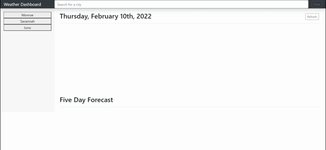

# Password Generator
## Description
For this project, I created a weather dashboard application. This application demonstrates my skills with javascript and server-side APIs. 

## Table of Contents
- [Usage](#usage)
- [User Story](#user-story)
- [Acceptance Criteria](#acceptance-criteria)
- [Credits](#credits)
- [License](#license)

## Usage
Visit my [Weather Dashboard here](https://quadrilateral0.github.io/Weather-Dashboard/). The following animation shows the web application's appearance and functionality:



## User Story

```
AS A traveler
I WANT to see the weather outlook for multiple cities
SO THAT I can plan a trip accordingly
```

## Acceptance Criteria

```
GIVEN a weather dashboard with form inputs
WHEN I search for a city
THEN I am presented with current and future conditions for that city and that city is added to the search history
WHEN I view current weather conditions for that city
THEN I am presented with the city name, the date, an icon representation of weather conditions, the temperature, the humidity, the wind speed, and the UV index
WHEN I view the UV index
THEN I am presented with a color that indicates whether the conditions are favorable, moderate, or severe
WHEN I view future weather conditions for that city
THEN I am presented with a 5-day forecast that displays the date, an icon representation of weather conditions, the temperature, the wind speed, and the humidity
WHEN I click on a city in the search history
THEN I am again presented with current and future conditions for that city
```

## Credits
A thanks to my resources:
- [OpenWeather - One Call API](https://openweathermap.org/api/one-call-api)
- [Moment.js](https://momentjs.com/)
- [Bootstrap](https://getbootstrap.com/docs/5.1/getting-started/introduction/)
- [Screencastify - Chrome Extension](https://www.screencastify.com/?gclid=Cj0KCQiAgP6PBhDmARIsAPWMq6kirDwVSm0ryb7sQeSxVQuZG-G7kk9ikfSz77SBh-fA7QS9aKdyjgAaAgJGEALw_wcB)
- [Visual Studio Code](https://code.visualstudio.com/download)

And thanks to these tutorials:
- [W3 Schools](https://www.w3schools.com/)
- [MDN Web Docs](https://developer.mozilla.org/)

## License

